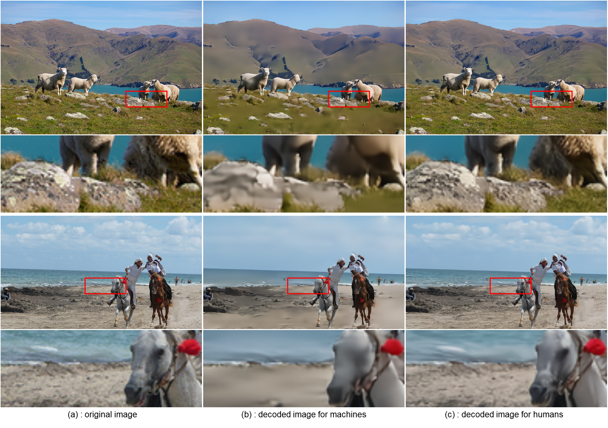

<div align="center">

### Scalable Image Coding for Humans and Machines
### Image Coding for Machines
</div>

---
---

This is the official implementation of the following papers.<br>
<br>
・Image Coding for Machines with Edge Information Learning Using Segment Anything
([arXiv](https://arxiv.org/abs/2403.04173))<br>

[](https://arxiv.org/abs/2403.04173)
[](https://arxiv.org/abs/2403.04173)
<br>
<br>
・Scalable Image Coding for Humans and Machines Using Feature Fusion Network
([arXiv](https://arxiv.org/abs/2405.09152))<br>

[](https://arxiv.org/abs/2405.09152)
[](https://arxiv.org/abs/2405.09152)

---

<div align="center">
  
### Installation
</div>

1. Clone this repository from GitHub.
```
git clone https://github.com/final-0/ICM-v1.git
```
2. Change the current directory to the "ICM-v1" folder.
```
cd ICM-v1/
```
3. Install the required dependencies in the current directory.

```
pip3 install -r requirements.txt 
```

---


<div align="center">

### Recommended Specs
</div>

For testing only, a GPU with about 11GB of memory is sufficient. (e.g. 1080ti, 2080ti)

---

<div align="center">
  
### Usage
</div>

Download [model checkpoints](https://drive.google.com/drive/folders/1wqK1HXZ4Ua3jqo2GHkxHJzIojsueI3xx?usp=drive_link). You can obtain "ica.pth.tar" and "icm.pth.tar" from this link. These checkpoints can be used by placing them in the "param" folder.<br>
``` 
param ---- param_details.txt
       |-- icm.pth.tar (image compression model for Machines)
       |-- ica.pth.tar (additional information compression model)
```
If you want to compress images for "Machines", run the following command :
``` 
python3 coding_m.py --checkpoint param/icm.pth.tar --input image/input
```
Add “--real” to the command to obtain a bit-stream:
``` 
python3 coding_m.py --checkpoint param/icm.pth.tar --input image/input --real
```
If you want to compress images for "Humans" & "Machines", run the following command :
``` 
python3 coding_hm.py --checkpoint_m param/icm.pth.tar --checkpoint_a param/ica.pth.tar --input image/input
```

---
---

<div align="center">
  
### Reconstructed Samples
</div>




<!--

-->
